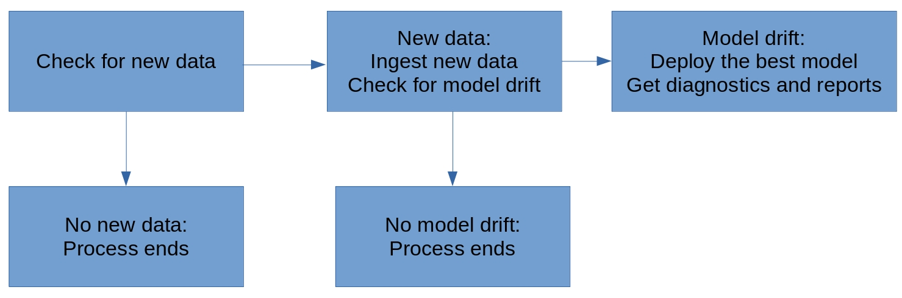

# Udacity MLOps Nanodegree Final Project

## Key Assumptions
 - New data files (`csv`) are deposited into a specified folder.
 - All files in the specified folder should be combined into a single dataset.
 - Feature columns are `lastmonth_activity`, `lastyear_activity`, `number_of_employees`
 - Features are `numerical`.
 - Label column to predict is `exited`.
 - Labels are `binary`.

## ML Pipeline

### Project Configuration
Using `config.json` the following items are set:
 - `input_folder_path` contains all files to be used in current dataset
 - `output_folder_path` a copy of the current dataset will be written here
 - `test_data_path` a witheld dataset in csv format for model testing.
 - `output_model_path` a copy of the current model will be written here
 - `prod_deployment_path` the model stored here is served by a web API
 - `db_path` path to a sqlite database

### Data Ingestion
1. Locate all files in data folder.
2. Compile data in all files into single dataset.
3. Deduplicate.

### Model Training
 - `sklearn.LogisticRegression`

### Diagnostics
The following diagnostic items are tracked for each dataset.
 - Column-wise mean, median, and standard deviation.
 - Column-wise percent of missing values.
 - Time required to ingest dataset.
 - Time required to train on the dataset
 - Model f1 score.
 - All pip packages installed, current and latest-available versions

### Deployment
For serving of the model and associated metrics, a number of files are written to a deployment folder specified in the config.
 - `trainedmodel.pkl` 

### Pipeline Automation

